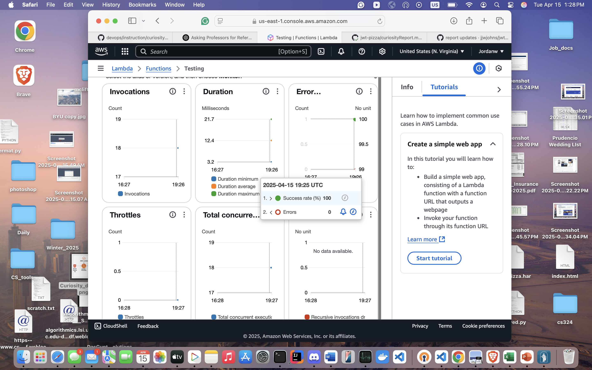

# AWS Lambda Curiosity Report

## Why I chose Lambda
I chose to dive into AWS Lambda because I didn't feel like I completely understood what a serverless application was. After some quick research into popular serverless methods I found that AWS Lambda is very simple and quite popular serverless method. So I decided to explore it and figure out what it was how it worked and create a small example.

## Lambda Overview
AWS Lambda is a compute service on AWS. You define a function and a trigger event and AWS will run your function whenever the event occurs. For example you can set up a front end that calls http API endpoints and you can define lambda functions for those http API calls. Whenever a client calls those endpoint your lambda event triggers and AWS will run your function. It is serverless because you don't have to worry about managing servers, instances, clusters, or any equivalent. AWS takes care of it all.


Key points of AWS Lambda

- Basic computing service on AWS
- Only charged for function run times
- AWS manages the servers and automatically scales when needed
- Really good for small applications or basic event-driven tasks

---

## My Experiment
I set up a really basic lambda function and put the event trigger to be when I updated my Pizza S3 bucket. All the function did was log out "Pizza S3 Bucket was updated!" Then I pushed to my git which ran the pipeline to update my S3 bucket. Then I went to my lambda function and I could see in the Lambda Monitor tab that it had recognized the S3 event and it ran my function (I've included a screenshot below).



---

## Architecture Diagram (image generated by AI - ChatGPT)


This diagram shows the basic architecture flow of Lambda. This example shows how a lambda function can store information about S3 updates in a database. When a user makes an update to the specified S3 bucket an event is triggered in AWS Lambda which causes the written function to run. The function then stores a log with basic info about the update in a specified database.

Flow
- A user does something to trigger an event (updates a S3 bucket).
- AWS Lambda recognizes this and triggers the function.
- The function runs (stores a log in a database).

---

## Example Use Case
S3 update Database logging (same as diagram above)

### Lambda Code (code generated by AI - ChatGPT)
```python
def lambda_handler(event, context):
    # Extract bucket name and object key from the S3 event
    bucket_name = event['Records'][0]['s3']['bucket']['name']
    object_key = event['Records'][0]['s3']['object']['key']
    
    # Prepare log data to store in DynamoDB
    log_entry = {
        'id': str(int(time.time())),  # Use current timestamp as a unique ID
        'timestamp': datetime.utcnow().strftime('%Y-%m-%d %H:%M:%S'),
        'bucket': bucket_name,
        'object_key': object_key,
        'event': 'S3 File Upload'
    }
    
    # Save log entry to DynamoDB
    try:
        table.put_item(Item=log_entry)
        return {
            'statusCode': 200,
            'body': json.dumps(f"Log stored successfully: {log_entry}")
        }
    except Exception as e:
        return {
            'statusCode': 500,
            'body': json.dumps(f"Error storing log: {str(e)}")
        }
```

## Conclusion/Final Thoughts
I really enjoyed looking into AWS lambda! I feel like I learned a lot about it and serverless applications/code in general. I could see how AWS Lambda could be really helpful in things like lightweight applications, deployment workflows, real-time logging, and many other things. I really like that you only pay for runtime and you don't have to worry about managing servers. I was impressed at how user friendly the process was and I can see why this is a popular service. I hope to be able to use this service in the future.