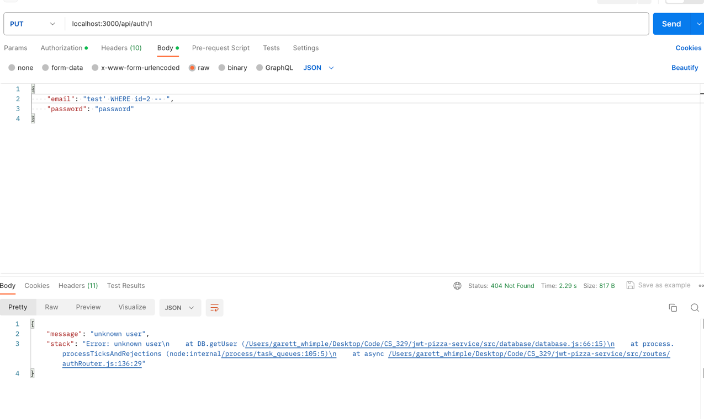
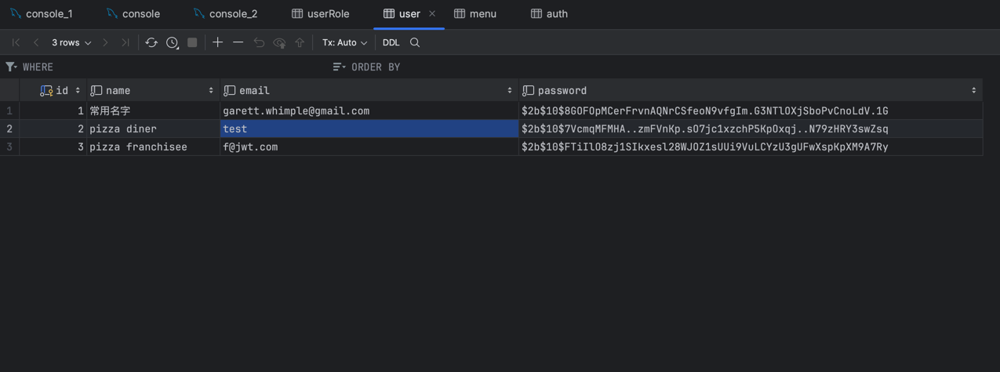
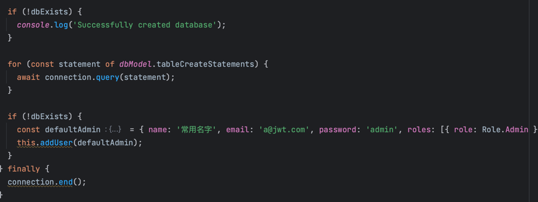
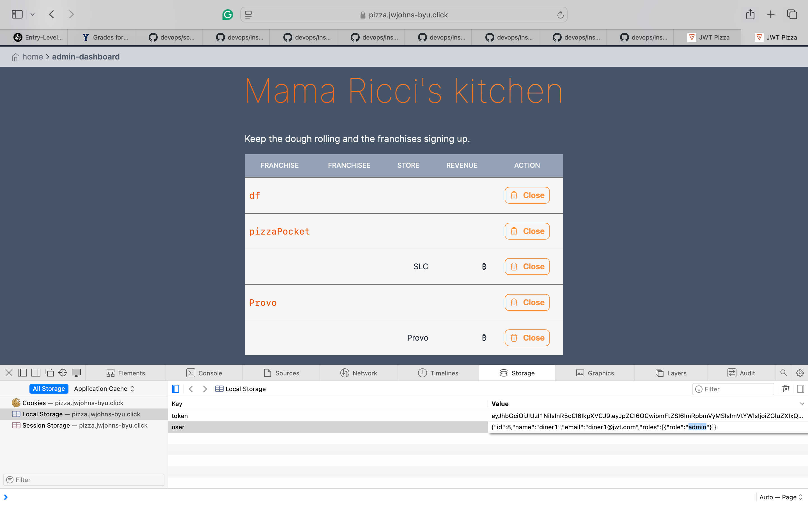
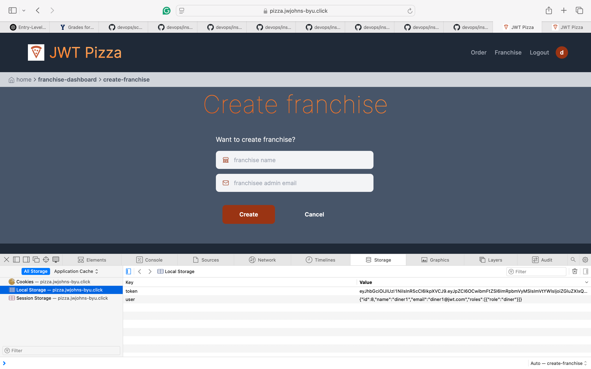
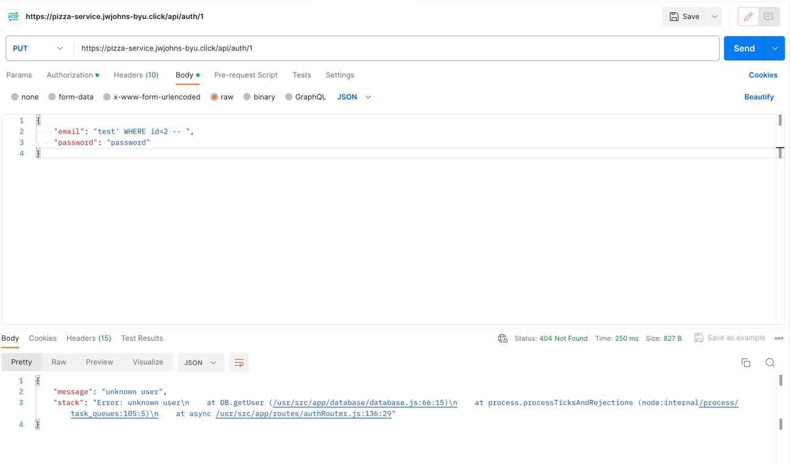
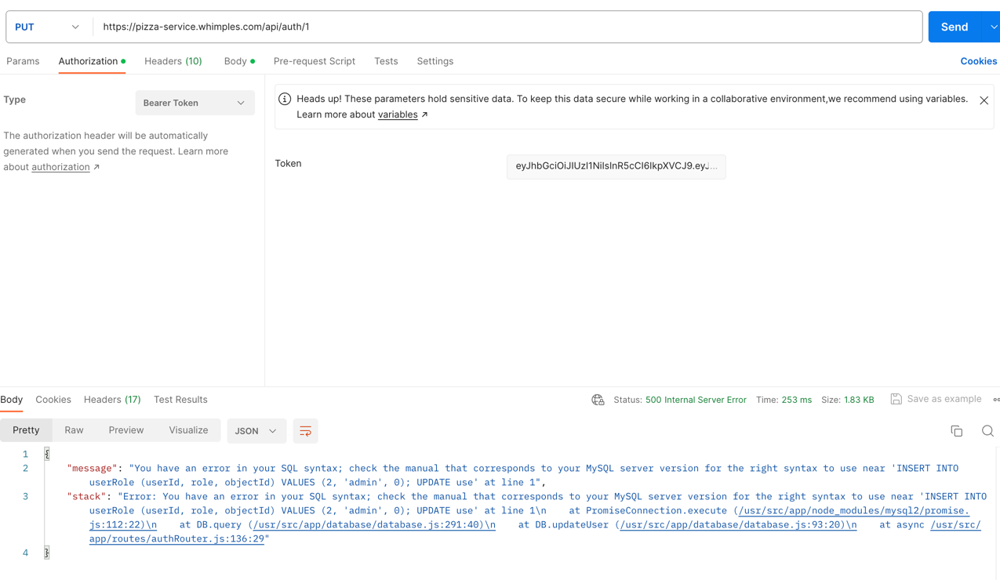

# Attack Record Report

## 1. Peers Names
- Garett Whimple
- Jordan Johns

## 2. Self Attack

### Peer 1: Garett Whimple

| Item           | Result                                                                                                                                                                                                                                                                   |
| -------------- |--------------------------------------------------------------------------------------------------------------------------------------------------------------------------------------------------------------------------------------------------------------------------|
| Date           | April 14, 2025                                                                                                                                                                                                                                                           |
| Target         | https://pizza.whimples.com/                                                                                                                                                                                                                                              |
| Classification | Injection (SQL Injection)                                                                                                                                                                                                                                                |
| Severity       | 2 - High                                                                                                                                                                                                                                                                 |
| Description    | Successfully exploited SQL injection vulnerability in the update user functionality. As an admin, was able to modify one user's information to match another user's details. Multi-queries were blocked, preventing manipulation of other tables or deletion operations. |
| Images         |                                                                                                                                                       |
| Corrections    | Implement parameterized queries to prevent SQL injection. Add input validation and sanitization. Disable detailed error messages in production environment.                                                                                                              |

| Item           | Result                                                                                                                                                                                                                                                                                |
| -------------- |---------------------------------------------------------------------------------------------------------------------------------------------------------------------------------------------------------------------------------------------------------------------------------------|
| Date           | April 14, 2025                                                                                                                                                                                                                                                                        |
| Target         | https://pizza.whimples.com/                                                                                                                                                                                                                                                           |
| Classification | Security Misconfiguration                                                                                                                                                                                                                                                             |
| Severity       | 2 - High                                                                                                                                                                                                                                                                              |
| Description    | Discovered that the database had a default admin account with predictable credentials that was automatically added during database initialization. This account could provide unauthorized administrative access if discovered by an attacker.                                        |
| Images         |                                                                                                                                                                                                                |
| Corrections    | Remove default admin accounts before deploying to production. If admin accounts are needed for initial setup, ensure they use strong, unique passwords and are removed or disabled after setup is complete. Implement a proper user provisioning process for administrative accounts. |

### Peer 2: Jordan John

| Item           | Result                                                                                                                                                                                                                                                                |
| -------------- |-----------------------------------------------------------------------------------------------------------------------------------------------------------------------------------------------------------------------------------------------------------------------|
| Date           | April 14, 2025                                                                                                                                                                                                                                                        |
| Target         | https://pizza.jwjohns-byu.click/                                                                                                                                                                                                                                          |
| Classification | Broken Access Control                                                                                                                                                                                                                                                 |
| Severity       | 2 - High                                                                                                                                                                                                                                                              |
| Description    | Successfully manipulated client-side authorization by modifying local storage values. Was able to change role to admin in local storage and gain unauthorized access to the admin dashboard. Some server-side protections still prevented actual manipulation of data. |
| Images         |                                                                                                                                               |
| Corrections    | Implement proper server-side authorization checks. Don't rely on client-side storage for sensitive authorization data. Use server-side sessions with proper authentication validation.                                                                                |

| Item           | Result                                                                                                                                                                                                                                                                                          |
| -------------- |-------------------------------------------------------------------------------------------------------------------------------------------------------------------------------------------------------------------------------------------------------------------------------------------------|
| Date           | April 14, 2025                                                                                                                                                                                                                                                                                  |
| Target         | https://pizza.jwjohns-byu.click/                                                                                                                                                                                                                                                                     |
| Classification | Broken Access Control                                                                                                                                                                                                                                                                           |
| Severity       | 2 - High                                                                                                                                                                                                                                                                                        |
| Description    | Was able to directly access restricted URLs such as create franchise and create store pages by navigating to them directly in the address bar, bypassing menu restrictions. Although able to access these pages, couldn't complete actual creation operations due to some server-side controls. |
| Images         |                                                                                                                                                                                                                   |
| Corrections    | Add route protection on the server side for all restricted URLs. Implement consistent authorization checks on all routes, not just UI restrictions.                                                                                                                                             |

## 3. Peer Attack

### Peer 1 (Garett Whimple) attack on Peer 2 (Jordan Johns)

| Item           | Result                                                                                                                                                                         |
| -------------- |--------------------------------------------------------------------------------------------------------------------------------------------------------------------------------|
| Date           | April 14, 2025                                                                                                                                                                 |
| Target         | https://pizza.jwjohns-byu.click/                                                                                                                                               |
| Classification | Injection (SQL Injection)                                                                                                                                                      |
| Severity       | 2 - High                                                                                                                                                                       |
| Description    | Successfully executed SQL injection attack on the update user functionality. With admin privileges, was able to modify one user's information to match another user's details. |
| Images         |                                                                                           |
| Corrections    | Implement parameterized queries. Add input validation for all user-supplied data. Use an ORM or prepared statements to prevent SQL injection.                                  |

| Item           | Result                                                                                                                                                                                                                                           |
| -------------- |--------------------------------------------------------------------------------------------------------------------------------------------------------------------------------------------------------------------------------------------------|
| Date           | April 14, 2025                                                                                                                                                                                                                                   |
| Target         | https://pizza.jwjohns-byu.click/                                                                                                                                                                                                                 |
| Classification | Sensitive Data Exposure                                                                                                                                                                                                                          |
| Severity       | 3 - Medium                                                                                                                                                                                                                                       |
| Description    | Discovered detailed error stack traces being exposed when application errors occurred. These stack traces revealed implementation details, file paths, and potentially sensitive system information that could be leveraged for further attacks. |
| Images         |                                                                                                                                                                                   |
| Corrections    | Implement proper error handling in production. Configure the application to display generic error messages to users while logging detailed information securely server-side.                                                                     |

### Peer 2 (Jordan Johns) attack on Peer 1 (Garett Whimple)

| Item           | Result                                                                         |
| -------------- | ------------------------------------------------------------------------------ |
| Date           | April 14, 2025                                                                 |
| Target         | https://pizza.whimples.com/                                                |
| Classification | Broken Access Control                                                  |
| Severity       | 2 - High                                                                       |
| Description    | Successfully manipulated client-side authorization by modifying local storage values. Was able to change role to admin in local storage and gain unauthorized access to the admin dashboard. Some server-side protections still prevented actual manipulation of data. |
| Images         |  |
| Corrections    | Implement proper server-side authorization checks. Don't rely on client-side storage for sensitive authorization data. Use server-side sessions with proper authentication validation. |

| Item           | Result                                                                                                                                                                                                                                                                                    |
| -------------- |-------------------------------------------------------------------------------------------------------------------------------------------------------------------------------------------------------------------------------------------------------------------------------------------|
| Date           | April 14, 2025                                                                                                                                                                                                                                                                            |
| Target         | https://pizza.whimples.com/                                                                                                                                                                                                                                                               |
| Classification | Broken Access Control                                                                                                                                                                                                                                                                     |
| Severity       | 2 - High                                                                                                                                                                                                                                                                                  |
| Description    | Was able to directly navigate to restricted URLs such as create franchise and create store pages by typing them directly in the address bar, bypassing normal menu restrictions. Though access to these pages was possible, server-side protections prevented actual creation operations. |
| Images         |                                                                                                                                                                                                             |
| Corrections    | Add server-side route protection for all restricted URLs and operations. Implement consistent authorization checks for all routes regardless of how they're accessed.                                                                                                                     |

| Item           | Result                                                                                                                                                                                                                                                          |
| -------------- |-----------------------------------------------------------------------------------------------------------------------------------------------------------------------------------------------------------------------------------------------------------------|
| Date           | April 14, 2025                                                                                                                                                                                                                                                  |
| Target         | https://pizza.whimples.com/                                                                                                                                                                                                                                     |
| Classification | Sensitive Data Exposure                                                                                                                                                                                                                                         |
| Severity       | 3 - Medium                                                                                                                                                                                                                                                      |
| Description    | Identified that the application was exposing detailed error stack traces when errors occurred. These traces revealed internal application structure, file paths, and potentially sensitive system information that could be used to plan more targeted attacks. |
| Images         |                                                                                                                                                                                                        |
| Corrections    | Configure proper error handling for production environments. Implement global error handlers that capture detailed errors for server-side logging while showing only generic messages to users.                                                                 |

## 4. Combined Summary of Learnings

Our security testing revealed several critical vulnerabilities that could significantly impact the application's security:

1. **SQL Injection Vulnerabilities**: Both applications were vulnerable to SQL injection attacks, allowing unauthorized manipulation of user data. While multi-queries were blocked, preventing more severe damage, this still represents a serious security risk.

2. **Broken Access Control**: Both applications had issues with access control mechanisms. Users could:
   - Access restricted pages they shouldn't be able to see
   - Manipulate client-side storage to elevate privileges
   - View administrative interfaces without proper authorization
   - Directly navigate to restricted URLs by typing them in the address bar

3. **Information Disclosure**: Detailed error messages were being displayed to users, potentially revealing sensitive implementation details that attackers could leverage for more sophisticated attacks.

4. **Client-Side Security Weaknesses**: Both applications relied too heavily on client-side security controls, which are inherently vulnerable to manipulation.

5. **Security Misconfiguration**: Default administrative accounts were discovered, which could provide unauthorized access if discovered by attackers.

### Key Lessons Learned:

1. **Never Trust Client-Side Data**: Any data that can be manipulated by the client (cookies, local storage, hidden fields) should never be used for authentication or authorization purposes without server-side validation.

2. **Defense in Depth**: Implement multiple layers of security. Even though some attacks gained partial access, additional server-side protections prevented complete compromise.

3. **Proper Error Handling**: Error messages should be generic for users and detailed for developers, with proper logging that doesn't expose sensitive information.

4. **Input Validation and Sanitization**: All user input must be properly validated and sanitized before being used in database queries or displayed to users.

5. **Server-Side Authorization**: Every sensitive operation must verify authorization on the server side, regardless of client-side restrictions.

6. **Route Protection**: All restricted URLs and endpoints should have server-side authorization checks, not just client-side menu hiding.

7. **Secure Default Configurations**: Remove default accounts, credentials, and configurations before deploying to production. Implement secure installation and initialization processes.

These findings highlight the importance of implementing security at all layers of the application. While client-side security measures improve user experience, they must always be backed by robust server-side validation and authorization checks.